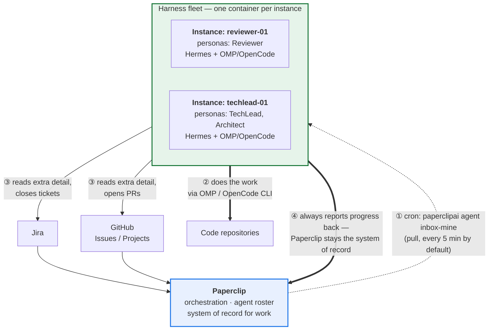

# Agentic Team (with Paperclip)

**Baseline containerized tooling for an agentic teammate group.** This repository builds and
publishes two container images that come preloaded and preconfigured with the harnesses an AI
agent teammate needs — [Hermes](#the-tools-inside-the-images), [OMP](#the-tools-inside-the-images)
and [OpenCode CLI](#the-tools-inside-the-images) — plus a variant that also carries
[Paperclip](#the-tools-inside-the-images), the orchestration layer the team collaborates through.

It ships the **starting point**, not a finished team: images, configuration templates, and the
documentation a *swarm owner* uses to design, configure and deploy their own agent fleet.

## What this is — and what it is not

|  | |
|---|---|
| ✅ **This repository provides** | Two container images (published to GHCR), a single-file instance config surface, copy-pasteable deployment and configuration templates, CI/CD that builds/publishes/releases the images, and the documentation tying it together. |
| 🧑‍💼 **The swarm owner provides** | Their team design (which personas, how many instances), credentials, the deployment itself (macOS, ECS Fargate, EKS), agent registration in Paperclip, and any environment-specific networking, identity or governance. |
| 🔧 **The upstream tools provide** | Everything about how an agent actually reasons, schedules, retries and collaborates. Hermes, OMP, OpenCode and Paperclip are real third-party products — this project **configures** them, it does not reimplement or wrap them. |

```mermaid
flowchart LR
    subgraph REPO["🏗️ This repository — the baseline"]
        direction TB
        IMG["Two container images<br/>harness · harness+Paperclip"]
        TPL["Config &amp; deploy templates<br/>instance.yaml · .env · ECS · EKS"]
        DOC["Configuration &amp; user<br/>documentation"]
        CI["CI/CD → GHCR<br/>+ GitHub Releases"]
    end

    subgraph OWNER["🧑‍💼 The swarm owner — builds their solution from it"]
        direction TB
        DESIGN["Designs the team<br/>personas per instance"]
        DEPLOY["Deploys the containers<br/>macOS · ECS Fargate · EKS"]
        REGISTER["Registers each agent<br/>in Paperclip"]
        CREDS["Supplies credentials<br/>.env · Secrets Manager"]
    end

    subgraph UPSTREAM["🔧 Upstream tools — not built here"]
        direction TB
        HERMES["Hermes<br/>always-on harness + cron"]
        OMPOC["OMP · OpenCode CLI<br/>coding harnesses"]
        PC["Paperclip<br/>orchestration &amp; collaboration"]
    end

    REPO ==>|"pull &amp; configure"| OWNER
    OWNER ==>|"runs"| UPSTREAM

    style REPO fill:#e8f0fe,stroke:#1a73e8,stroke-width:2px
    style OWNER fill:#e6f4ea,stroke:#137333,stroke-width:2px
    style UPSTREAM fill:#fef7e0,stroke:#b06000,stroke-width:2px
```



## What a running swarm looks like

Each instance is a long-lived container. Hermes is the always-on harness: its built-in cron
scheduler pulls that instance's assigned work from Paperclip, and Hermes can drive OMP or
OpenCode CLI behind the scenes to do the actual coding. Work flows **pull-based** — Paperclip
never needs to reach into an instance.



Each instance's own settings live in a single file, `/data/instance.yaml`, on a persistent volume
the swarm owner mounts — personas, model host, and *references* to credentials (never the
credentials themselves). See the [configuration reference](user-docs/configuration-reference.md).

## The tools inside the images

All four are real, independently maintained third-party products. This project installs and
configures them; their behavior, CLI surface and roadmap belong to their own maintainers.

| Tool | What it does here | Links |
|---|---|---|
| **Hermes** (Nous Research Hermes Agent) | The always-on default harness; runs on container start and provides the built-in **cron scheduler** that pulls work from Paperclip. Can orchestrate OMP/OpenCode behind the scenes. | [repo](https://github.com/nousresearch/hermes-agent) · [cron docs](https://hermes-agent.nousresearch.com/docs/user-guide/features/cron) |
| **OMP** (oh-my-pi) | A coding harness available in every instance for the swarm owner to configure and use. | [repo](https://github.com/can1357/oh-my-pi) · [CLI docs](https://omp.sh/docs/cli) |
| **OpenCode CLI** | A coding harness available in every instance; supports headless/automation use (`opencode run`, `opencode serve`). | [site](https://opencode.ai) · [CLI docs](https://opencode.ai/docs/cli/) |
| **Paperclip** | The orchestration and collaboration plane: holds the agent roster/org chart, tracks work (its own, plus synced Jira and GitHub items), and is the system of record agents report back to. Included in the second image variant. | [site](https://paperclip.ing/) · [docs](https://docs.paperclip.ing/reference/api/overview/) · [repo](https://github.com/paperclipai/paperclip) |

Which harnesses an instance actually *uses* is the swarm owner's design decision — all three are
installed so that decision doesn't require rebuilding an image.

## Quick start

```sh
mkdir -p ~/agentic-team/my-agent/data
cp templates/env/.env.example ~/agentic-team/my-agent/.env   # then fill it in

container run --name my-agent \
  --volume ~/agentic-team/my-agent/data:/data \
  --env-file ~/agentic-team/my-agent/.env \
  ghcr.io/stainedhead/agentic-team-w-paperclip/harness:latest
```

The first start writes a default `/data/instance.yaml` you then edit and reuse across restarts.
Full walkthrough: **[user-docs/getting-started.md](user-docs/getting-started.md)**.

Two image variants are published:

| Image | Contents | Use when |
|---|---|---|
| `ghcr.io/stainedhead/agentic-team-w-paperclip/harness` | Hermes + OMP + OpenCode CLI, `gh`, `yq`. Hermes runs on start. | Paperclip already runs elsewhere — this is the normal fleet instance. |
| `ghcr.io/stainedhead/agentic-team-w-paperclip/paperclip` | Everything above **plus Paperclip**. Both run on start. | This instance should also host the Paperclip orchestration plane. |

## Documentation

**Using the fleet** — [user-docs/](user-docs/)
- [getting-started.md](user-docs/getting-started.md) — run your first instance end to end.
- [configuration-reference.md](user-docs/configuration-reference.md) — every `instance.yaml` field.
- [usage-examples.md](user-docs/usage-examples.md) — worked examples for common setups.

**Configuring and deploying the platform** — [configuration-docs/](configuration-docs/)
- [credentials-and-secrets.md](configuration-docs/credentials-and-secrets.md) — the `*_ref`
  pattern, local `.env`, AWS Secrets Manager.
- [paperclip-agent-registration.md](configuration-docs/paperclip-agent-registration.md) — register
  an instance's agent identity and persona in Paperclip.
- [github-cli-and-pat.md](configuration-docs/github-cli-and-pat.md) — `gh` CLI and PAT setup.
- [deploy-macos-container.md](configuration-docs/deploy-macos-container.md) ·
  [deploy-ecs-fargate.md](configuration-docs/deploy-ecs-fargate.md) ·
  [deploy-eks.md](configuration-docs/deploy-eks.md) — per-target deployment recipes.
- [building-the-images.md](configuration-docs/building-the-images.md) — build, customize and
  publish your own variants.

**Copy-pasteable starting points** — [templates/](templates/)
- `templates/env/` — `.env.example` files for both image variants.
- `templates/instance/` — annotated `instance.yaml` examples.
- `templates/aws-ecs/` · `templates/aws-eks/` · `templates/macos-container/` — task definitions,
  Kubernetes manifests, and a run script.

**Product and design** — [documentation/](documentation/)
- [product-summary.md](documentation/product-summary.md) — the elevator pitch.
- [product-details.md](documentation/product-details.md) — components, workflows, boundaries.
- [technical-architecture.md](documentation/technical-architecture.md) — image lineage, build
  pipeline, and the still-unbuilt target AWS design.
- [architectual-decisions-record.md](documentation/architectual-decisions-record.md) — the ADR log.

**Project context**
- [INTENT.md](INTENT.md) — why this project exists and what it is aiming at.
- [AGENTS.md](AGENTS.md) — rules for agents and contributors, including how docs are kept current.
- [specs/archive/](specs/archive/) — completed feature specs and their source PRDs. No spec is
  currently active.
- [initial-context.md](initial-context.md) — the original AWS-only architecture draft. **Frozen**;
  superseded by `documentation/technical-architecture.md` where they differ.

## Status

| Area | State |
|---|---|
| Container images (Dockerfiles, entrypoints, config bootstrap) | Implemented |
| CI/CD — lint, smoke build, multi-arch publish to GHCR, release tagging | Implemented |
| Configuration and user documentation, templates | Implemented |
| **Verified by a real `docker build` / `docker run`** | **Not yet** — see below |

The images have never been built by a Docker daemon. They were written and reviewed statically,
because no daemon was available in the environment they were authored in. The CI workflow now
includes a **`smoke-build` job** that builds both images single-arch, runs them, and asserts that
every tool is on `PATH` after the non-root privilege drop and that the `instance.yaml` bootstrap
works — so the first CI run is what will confirm or refute this. Treat the images as unverified
until that job has passed once.

Two things that job is specifically expected to settle:
- whether each installer's binaries remain reachable after the image drops to the `agent` user;
- whether Paperclip's installer brings its own Node.js (the entrypoint invokes it as
  `npx paperclipai`, and upstream does not document this).

Also unverified against upstream docs: the literal `hermes gateway run --foreground` invocation
used as PID 1, and `hermes cron create`'s own de-duplication behavior (the bootstrap guards
against duplicates itself rather than relying on it).

## Licensing

This repository has **no `LICENSE` file yet**. Since its whole purpose is for others to build from
it, adding one is worth doing deliberately — that choice belongs to the repository owner.
