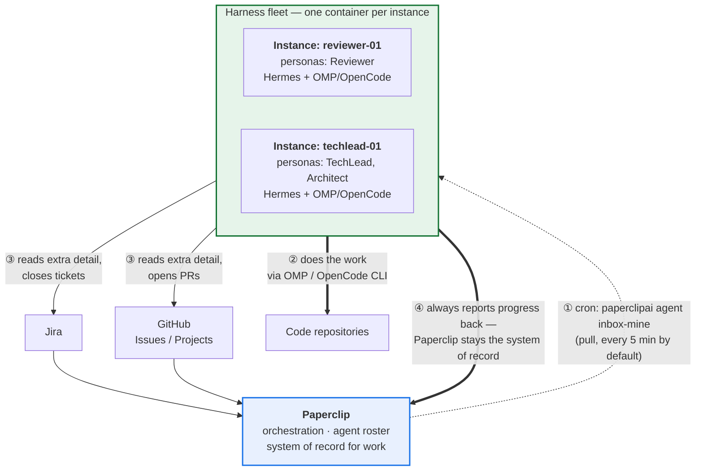

# Agentic Team (with Paperclip)

**Baseline containerized tooling for an agentic teammate group.** This repository builds and
publishes two container images that come preloaded and preconfigured with the harnesses an AI
agent teammate needs — [Hermes](#the-tools-inside-the-images), [OMP](#the-tools-inside-the-images)
and [OpenCode CLI](#the-tools-inside-the-images) — plus a variant that also carries
[Paperclip](#the-tools-inside-the-images), the orchestration layer the team collaborates through.

It ships the **starting point**, not a finished team: images, configuration templates, and the
documentation a *swarm owner* uses to design, configure and deploy their own agent fleet.

## What this is — and what it is not

|  | |
|---|---|
| ✅ **This repository provides** | Two container images (published to GHCR), a single-file instance config surface, copy-pasteable deployment and configuration templates, CI/CD that builds/publishes/releases the images, and the documentation tying it together. |
| 🧑‍💼 **The swarm owner provides** | Their team design (which personas, how many instances), credentials, the deployment itself (macOS, ECS Fargate, EKS), agent registration in Paperclip, and any environment-specific networking, identity or governance. |
| 🔧 **The upstream tools provide** | Everything about how an agent actually reasons, schedules, retries and collaborates. Hermes, OMP, OpenCode and Paperclip are real third-party products — this project **configures** them, it does not reimplement or wrap them. |

```mermaid
flowchart LR
    subgraph REPO["🏗️ This repository — the baseline"]
        direction TB
        IMG["Two container images<br/>harness · harness+Paperclip"]
        TPL["Config &amp; deploy templates<br/>instance.yaml · .env · ECS · EKS"]
        DOC["Configuration &amp; user<br/>documentation"]
        CI["CI/CD → GHCR<br/>+ GitHub Releases"]
    end

    subgraph OWNER["🧑‍💼 The swarm owner — builds their solution from it"]
        direction TB
        DESIGN["Designs the team<br/>personas per instance"]
        DEPLOY["Deploys the containers<br/>macOS · ECS Fargate · EKS"]
        REGISTER["Registers each agent<br/>in Paperclip"]
        CREDS["Supplies credentials<br/>.env · Secrets Manager"]
    end

    subgraph UPSTREAM["🔧 Upstream tools — not built here"]
        direction TB
        HERMES["Hermes<br/>always-on harness + cron"]
        OMPOC["OMP · OpenCode CLI<br/>coding harnesses"]
        PC["Paperclip<br/>orchestration &amp; collaboration"]
    end

    REPO ==>|"pull &amp; configure"| OWNER
    OWNER ==>|"runs"| UPSTREAM

    style REPO fill:#e8f0fe,stroke:#1a73e8,stroke-width:2px
    style OWNER fill:#e6f4ea,stroke:#137333,stroke-width:2px
    style UPSTREAM fill:#fef7e0,stroke:#b06000,stroke-width:2px
```



## What a running swarm looks like

Each instance is a long-lived container. Hermes is the always-on harness: its built-in cron
scheduler pulls that instance's assigned work from Paperclip, and Hermes can drive OMP or
OpenCode CLI behind the scenes to do the actual coding. Work flows **pull-based** — Paperclip
never needs to reach into an instance.



Each instance's own settings live in a single file, `/data/instance.yaml`, on a persistent volume
the swarm owner mounts — personas, model host, and *references* to credentials (never the
credentials themselves). See the [configuration reference](user-docs/configuration-reference.md).

## The tools inside the images

All four are real, independently maintained third-party products. This project installs and
configures them; their behavior, CLI surface and roadmap belong to their own maintainers.

| Tool | What it does here | Links |
|---|---|---|
| **Hermes** (Nous Research Hermes Agent) | The always-on default harness; runs on container start and provides the built-in **cron scheduler** that pulls work from Paperclip. Can orchestrate OMP/OpenCode behind the scenes. | [repo](https://github.com/nousresearch/hermes-agent) · [cron docs](https://hermes-agent.nousresearch.com/docs/user-guide/features/cron) |
| **OMP** (oh-my-pi) | A coding harness available in every instance for the swarm owner to configure and use. | [repo](https://github.com/can1357/oh-my-pi) · [CLI docs](https://omp.sh/docs/cli) |
| **OpenCode CLI** | A coding harness available in every instance; supports headless/automation use (`opencode run`, `opencode serve`). | [site](https://opencode.ai) · [CLI docs](https://opencode.ai/docs/cli/) |
| **Paperclip** | The orchestration and collaboration plane: holds the agent roster/org chart, tracks work (its own, plus synced Jira and GitHub items), and is the system of record agents report back to. Included in the second image variant. | [site](https://paperclip.ing/) · [docs](https://docs.paperclip.ing/reference/api/overview/) · [repo](https://github.com/paperclipai/paperclip) |

Which harnesses an instance actually *uses* is the swarm owner's design decision — all three are
installed so that decision doesn't require rebuilding an image.

## Quick start

```sh
mkdir -p ~/agentic-team/my-agent/data
cp templates/env/.env.example ~/agentic-team/my-agent/.env   # then fill it in

container run --name my-agent \
  --volume ~/agentic-team/my-agent/data:/data \
  --env-file ~/agentic-team/my-agent/.env \
  ghcr.io/stainedhead/agentic-team-w-paperclip/harness:latest
```

The first start writes a default `/data/instance.yaml` you then edit and reuse across restarts.
Full walkthrough: **[user-docs/getting-started.md](user-docs/getting-started.md)**.

Two image variants are published:

| Image | Contents | Use when |
|---|---|---|
| `ghcr.io/stainedhead/agentic-team-w-paperclip/harness` | Hermes + OMP + OpenCode CLI, `gh`, `yq`. Hermes runs on start. | Paperclip already runs elsewhere — this is the normal fleet instance. |
| `ghcr.io/stainedhead/agentic-team-w-paperclip/paperclip` | Everything above **plus Paperclip**. Both run on start. | This instance should also host the Paperclip orchestration plane. |

## Documentation

**Using the fleet** — [user-docs/](user-docs/)
- [getting-started.md](user-docs/getting-started.md) — run your first instance end to end.
- [configuration-reference.md](user-docs/configuration-reference.md) — every `instance.yaml` field.
- [usage-examples.md](user-docs/usage-examples.md) — worked examples for common setups.

**Configuring and deploying the platform** — [configuration-docs/](configuration-docs/)
- [credentials-and-secrets.md](configuration-docs/credentials-and-secrets.md) — the `*_ref`
  pattern, local `.env`, AWS Secrets Manager.
- [paperclip-agent-registration.md](configuration-docs/paperclip-agent-registration.md) — register
  an instance's agent identity and persona in Paperclip.
- [github-cli-and-pat.md](configuration-docs/github-cli-and-pat.md) — `gh` CLI and PAT setup.
- [deploy-macos-container.md](configuration-docs/deploy-macos-container.md) ·
  [deploy-ecs-fargate.md](configuration-docs/deploy-ecs-fargate.md) ·
  [deploy-eks.md](configuration-docs/deploy-eks.md) — per-target deployment recipes.
- [building-the-images.md](configuration-docs/building-the-images.md) — build, customize and
  publish your own variants.

**Copy-pasteable starting points** — [templates/](templates/)
- `templates/env/` — `.env.example` files for both image variants.
- `templates/instance/` — annotated `instance.yaml` examples.
- `templates/aws-ecs/` · `templates/aws-eks/` · `templates/macos-container/` — task definitions,
  Kubernetes manifests, and a run script.

**Product and design** — [documentation/](documentation/)
- [product-summary.md](documentation/product-summary.md) — the elevator pitch.
- [product-details.md](documentation/product-details.md) — components, workflows, boundaries.
- [technical-architecture.md](documentation/technical-architecture.md) — image lineage, build
  pipeline, and the still-unbuilt target AWS design.
- [architectual-decisions-record.md](documentation/architectual-decisions-record.md) — the ADR log.

**Project context**
- [INTENT.md](INTENT.md) — why this project exists and what it is aiming at.
- [AGENTS.md](AGENTS.md) — rules for agents and contributors, including how docs are kept current.
- [specs/archive/](specs/archive/) — completed feature specs and their source PRDs. No spec is
  currently active.
- [initial-context.md](initial-context.md) — the original AWS-only architecture draft. **Frozen**;
  superseded by `documentation/technical-architecture.md` where they differ.

## Status

| Area | State |
|---|---|
| Container images (Dockerfiles, entrypoints, config bootstrap) | Implemented |
| CI/CD — lint, smoke build, multi-arch publish to GHCR, release tagging | Implemented |
| Configuration and user documentation, templates | Implemented |
| **Harness image — builds and runs** | ✅ **Verified in CI** |
| **Harness+Paperclip image — builds and runs** | ✅ **Verified in CI** |

The images were originally written and reviewed *statically*, with no Docker daemon available. CI now
has a **`smoke-build` job** that builds both images single-arch, runs them, and asserts what static
reading cannot. Running it for real found four defects that review had missed — which is the honest
argument for having it.

**Confirmed working** — actual assertion output from both images:

```
whoami=agent uid=1000 HOME=/home/agent
ok: hermes   -> /home/agent/.local/bin/hermes
ok: omp      -> /home/agent/.local/bin/omp
ok: opencode -> /home/agent/.opencode/bin/opencode
ok: yq       -> /usr/local/bin/yq
ok: gh       -> /usr/bin/gh
ok: git      -> /usr/bin/git
ok: bootstrapped /data/instance.yaml
ok: wrote /home/agent/.hermes/.env
ok: npx      -> /usr/bin/npx          # paperclip image
```

Both images build, run as the non-root user, keep every tool on `PATH` after the privilege drop, and
bootstrap `instance.yaml` correctly. What the builds taught us, none of it visible to review:

- **`libatomic1` was missing.** Hermes's package manager downloads a Node.js toolchain that links
  `libatomic.so.1`; the installer reported only `✗ pm install failed`.
- **Paperclip does not bundle Node.js**, and its `install.sh` cannot run non-interactively at all — it
  passes a `--no-prompt` flag the published package rejects. Node 22 and `paperclipai` are now
  installed directly; see ADR-0015.
- **`opencode` lives in `/home/agent/.opencode/bin`**, a directory the original `PATH` did not contain
  — that tool would not have been reachable at all.
- **Buildx cannot see `docker load`ed images**, so the paperclip build could not use the
  freshly-built harness image as its base until the job was given a throwaway local registry.

What `smoke-build` **does not** cover:

- **Volume permissions.** It runs with no volume mounted, exercising the image's own `/data` rather
  than a real bind mount, PVC or EFS access point. Whether *your* volume is writable by uid 1000 is
  the most common real deployment failure, and only your deployment can prove it — each
  `configuration-docs/deploy-*.md` says what to set.
- **The entrypoints themselves.** It sources the bootstrap rather than running the entrypoint, which
  would block on the Hermes gateway. So `hermes gateway run --foreground` as the container's main
  process remains the main unverified runtime assumption, along with `hermes cron create`'s own
  de-duplication behavior (the bootstrap guards against duplicates itself rather than relying on it).
- **`linux/arm64` runtime behavior is now covered** — `smoke-build` runs as a per-architecture matrix
  on native runners, so the arm64 images are built and executed rather than assumed. Apple Silicon
  lab machines and AWS Graviton both use arm64, so this is the local-development path, not an edge
  case.

## License

[MIT](LICENSE) — use it, fork it, build your own swarm from it, commercially or otherwise. Attribution
is the only requirement.

The four tools these images install (Hermes, OMP, OpenCode CLI, Paperclip) carry **their own licenses**
from their own projects; this license covers only the packaging, configuration and documentation in
this repository. If you redistribute a built image, you are redistributing those tools too — check
their terms.
