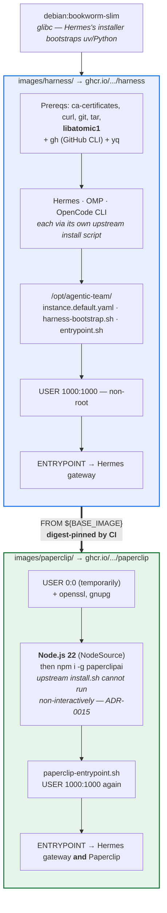
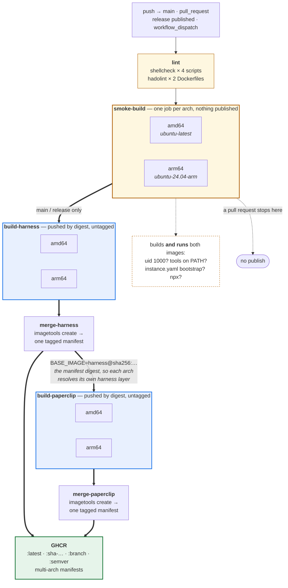

# Technical Architecture

> This is the living, authoritative architecture description for this project.
> `../initial-context.md` is the frozen originating draft — where the two differ, this file wins.

## Status
**Read Section 0 first.** It describes what this project actually builds and ships. Sections 1-6
are the original target enterprise design inherited from `../initial-context.md` (Okta SSO, Aurora
Serverless, ALB/API Gateway ingress, Cloud Map service discovery) — recorded design intent, still
**not built and not this project's deliverable** (see ADR-0010). Where the two conflict, Section 0
is what is real today.

Section 0 reflects `specs/archive/260927-agentic-team-w-paperclip/` and its code-review fix pass in
`specs/archive/260927-agentic-team-w-paperclip-auto-review/`, plus a docs/design review pass that
added CI's `smoke-build` job. **Both images now build and pass runtime verification in CI** — see
README.md's Status section for the assertion output and for what remains unverified (volume
permissions and the entrypoints as PID 1).

## 0. What's actually built (first shipped feature)

### Image lineage

Two images, the second built `FROM` the first so harness-layer changes stay in sync
automatically (ADR-0006). CI pins the `FROM` relationship **by digest**, not by the mutable
`:latest` tag, so the paperclip build cannot race against the harness build landing on the
registry.



Both Dockerfiles `COPY` their sidecar files by bare filename, so each image's **build context is
its own directory** (`docker build images/harness`), not the repo root. CI sets `context:`
accordingly — see `configuration-docs/building-the-images.md`.

### Build and publish pipeline

Every architecture is built on a **native runner** of that architecture, in parallel, and the results
are merged into one multi-arch manifest per image — no QEMU emulation anywhere (ADR-0016).



Pushing **by digest** with no tag is what lets two concurrent jobs contribute to the same image
without racing over a shared tag; the merge job is the only thing that applies tags.

### Components and behavior

- **Two container images** (`images/harness/`, `images/paperclip/`) — the harness-only image
  installs Hermes (Nous Research Hermes Agent), OMP (oh-my-pi), and OpenCode CLI via each tool's
  own verified install script, and runs Hermes on startup; the harness+Paperclip image is built
  `FROM` the harness image (see ADR-0006) and runs both Hermes and Paperclip.
- **CI/CD** (`.github/workflows/build-and-publish.yml`): `lint` (shellcheck, hadolint) →
  `smoke-build` (per-architecture matrix; builds both images and actually runs them to assert uid
  1000, tools on `PATH` post-privilege-drop, and a working `instance.yaml` bootstrap) →
  `build-harness` / `build-paperclip` (one job per architecture on a **native runner** of that
  architecture, pushed by digest) → `merge-*` (assembles the per-arch digests into one tagged
  multi-arch manifest per image). No QEMU emulation; see ADR-0016. Pull requests stop after
  `smoke-build`. A published GitHub Release semver-tags the images.
- **Both images run as a non-root user** (UID/GID 1000:1000), numerically rather than by name so a
  runtime checking "is this non-root" need not resolve the image's passwd file. Verified by execution
  in `smoke-build` on both architectures.
- **Paperclip itself is started via `npx paperclipai onboard --yes` until its instance config exists,
  then `npx paperclipai run`** — not a bare `paperclip` binary — with its data
  directory (`PAPERCLIP_HOME`) pointed at the same `/data` persistent volume as `instance.yaml`.
  A failed first start that only generated boot secrets retries onboarding on restart.
  It requires two boot-time secrets (`BETTER_AUTH_SECRET`,
  `PAPERCLIP_TOOL_ACTION_SIGNING_SECRET`) and uses an embedded PostgreSQL by default (no external
  `DATABASE_URL` needed) — see `configuration-docs/credentials-and-secrets.md`.
- **This product's own configuration surface**: a single `/data/instance.yaml` file per instance
  (persona assignment, model-host selection, credential references — see ADR-0008), bootstrapped
  from a default template on first start and reused thereafter, on a persistent-storage volume
  the swarm owner provides.
- **Work retrieval**: a Hermes cron job (default: every 5 minutes) calls Paperclip's own
  `agent inbox-mine` CLI (see ADR-0007). Bootstrap reconciles the job's schedule and agent id
  through the Hermes CLI on every start (ADR-0017).
- **Credentials**: never embedded in `instance.yaml`; resolved from the container's own
  environment (a `.env` file locally, AWS Secrets Manager as injected env vars in AWS) — see
  `configuration-docs/credentials-and-secrets.md`.
- **Deployment**: documented, not automated — example recipes exist for macOS `Container`, ECS
  Fargate, and EKS in `configuration-docs/deploy-*.md`. None of the Okta/Aurora/ALB/Cloud Map
  infrastructure in sections 1-6 below is part of this build.
- **Explicitly not this product's concern**: tool-internal failure behavior (poll retries,
  credential-failure handling, cron internals) — each tool owns its own; see
  `specs/archive/260927-agentic-team-w-paperclip/spec.md`'s Edge Case Handling section.

Full requirements traceability: `specs/archive/260927-agentic-team-w-paperclip/spec.md` and its sibling
`architecture.md`/`research.md`.

## 1. Platform layers (target design, not yet built)
- **Orchestration & Collaboration Plane**: a centralized Paperclip AI instance (ECS Fargate)
  managing org structure, agent heartbeats, project graphs, budgets, and developer collaboration.
  Runs the Paperclip AI Core Engine plus embedded Hermes & OpenCode CLI tooling. State store:
  Aurora Serverless v2 (PostgreSQL). Persistent files: EFS Access Point at
  `/orchestration/paperclip`.
- **Worker Fleet**: dedicated, long-running ECS Fargate tasks, one per agent persona (e.g.
  Security Auditor, Database Architect, QA Automation), each with its own task role, EFS access
  point, and secrets path.

## 2. Request flow
```
[ Developers / Browser / CLI ]
              │
              ▼
[ Ingress & Authentication ]
  - ALB (Okta OIDC Native Flow)
  - API Gateway (Okta JWT Authorizer)
              │
              ▼ (Private Subnet)
[ Paperclip Orchestrator Service (ECS Fargate) ]
              │
   AWS Cloud Map Private DNS
              │
   ┌──────────┼──────────┐
   ▼          ▼          ▼
[Worker:   [Worker:   [Worker:
 Security]  DB Arch]   QA Test]
```

## 3. Compute
- **Worker agents**: distinct long-running ECS services built from a single standardized base
  container image (runtime toolchain: Hermes, OMP, OpenCode CLI, Git, language SDKs). Fargate on
  Linux ARM64 (Graviton). Per task: 4 vCPU / 8 GB RAM / 50 GB ephemeral NVMe storage.
  - Ephemeral root: git checkouts, compilation output, AST caches, temp build scripts.
  - Persistent memory (EFS): bound to `~/.hermes/`, holds agent skills (`SKILL.md`), vector DBs,
    and long-term memory across restarts.
- **Orchestration task** (Paperclip AI): same compute profile (4 vCPU / 8 GB / 50 GB ephemeral).
  State: Aurora Serverless v2 (task graph, budget caps, execution locks, event logs). Artifacts:
  EFS Access Point at `/home/agent/.paperclip`.
- **Deployment pattern**: "Model 3: CDK Factory Pattern" — a single base image, workers built from
  it as distinct ECS services via a CDK factory.

## 4. Identity, security & isolation
- **IAM task role boundaries**: every worker runs under its own IAM role, scoping its blast
  radius to its assigned permissions.
- **Filesystem confinement**: one shared EFS filesystem, accessed exclusively via per-persona EFS
  Access Points — dedicated root directory (e.g. `/agents/security-auditor`), enforced POSIX
  UID/GID 1000:1000, permission mask 0750, no path traversal into sibling directories.
- **Credential isolation**: AWS Secrets Manager credentials scoped by path
  (`/agents/${AGENT_ID}/*`); IAM policy only allows retrieval of the matching path.
- **Ingress/Okta integration**: Paperclip has no native SSO. Identity is enforced at the AWS
  ingress boundary instead:
  - Browser access: internet-facing ALB with a native Okta OIDC "Authenticate" action; injects
    verified claims (`x-amzn-oidc-identity`, `x-amzn-oidc-data`) upstream.
  - Programmatic/API access: API Gateway (HTTP API) with an Okta JWT Authorizer, validated
    against Okta's JWKS, routed into the VPC via a VPC Link.

## 5. Inter-service communication
- Internal service discovery via AWS Cloud Map (`.agentic.local` private DNS).
- Worker tasks accept inbound traffic only from the Paperclip security group.
- Human-agent collaboration: developers use the Paperclip dashboard (Okta SSO) to review
  worktrees, budgets/token burn, assign issues, and invoke personas via `@agent-name`; Paperclip
  dispatches over private DNS and orchestrates downstream review loops between workers.

## 6. Cost model
Baseline per worker (4 vCPU / 8 GB / 50 GB ephemeral, Graviton, us-east-1, 730 hr/month):
~$117.77/month running 24/7, ~$31.45/month running business-hours-only. Shared infra (NAT
Gateway, Aurora Serverless v2, ALB, EFS Elastic IOPS) is amortized across the fleet. See
`../initial-context.md` §6 for the line-item breakdown.

## Open questions
- **Full local networking/service-discovery/identity-store design** equivalent to sections 1-6
  above remains out of scope for this product (the swarm owner's concern for their own local
  environment) — only the container + persistent-storage piece (Section 0) is this product's to
  build. See `documentation/architectual-decisions-record.md`'s "Open (not decided)" section.
